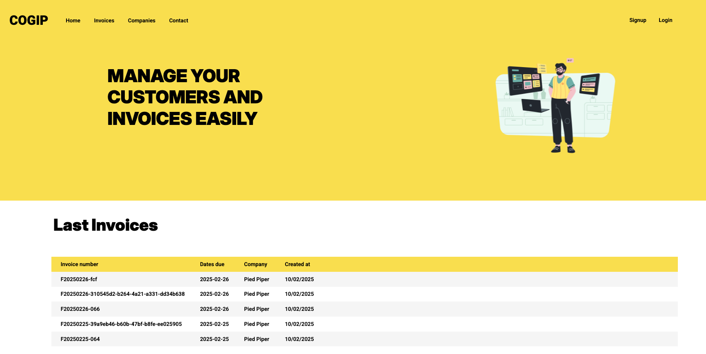
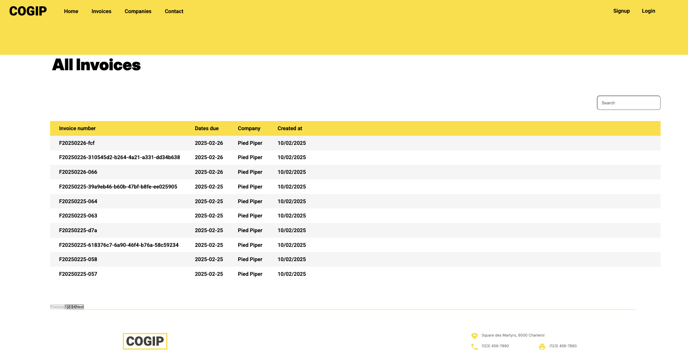
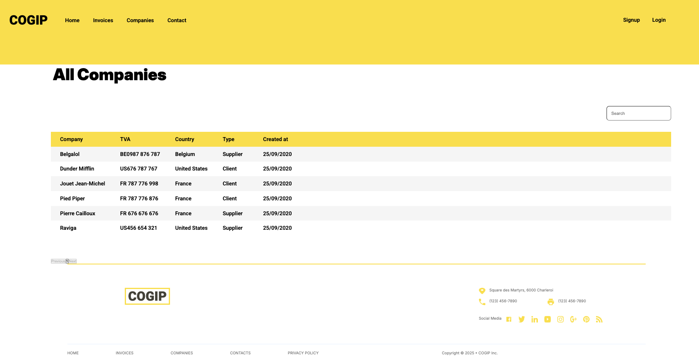
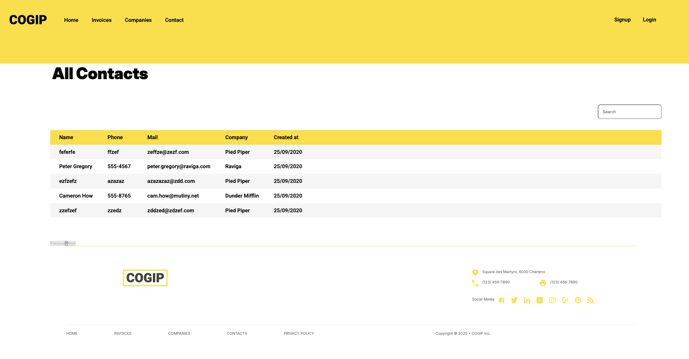
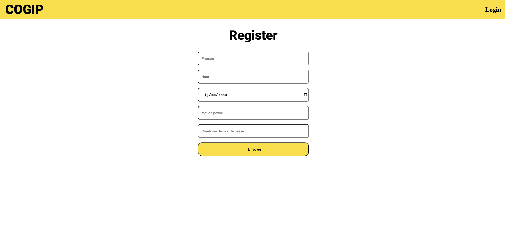
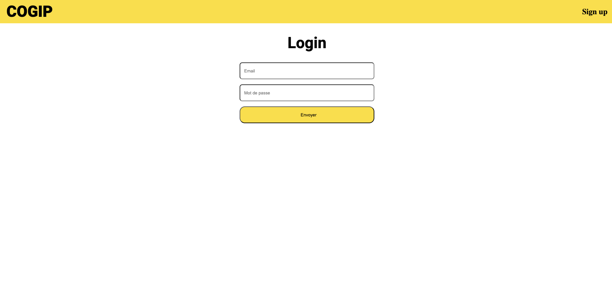

# 📑 COGIP Project

Bienvenue dans **COGIP Project**, une application web permettant de gérer les **factures**, les **clients** et les **contacts** de l'entreprise **COGIP**.  
Ce projet est développé avec **Angular** pour le front-end et **FastAPI (Python)** pour le back-end.

---

## 🚀 Technologies utilisées

### 🖥️ Front-End

  
  
  
  

### ⚙️ Back-End

  
  
  
  

---

## 📂 Fonctionnalités

- 🔍 Gestion des **factures** (création, modification, suppression)  
- 🏢 Gestion des **entreprises** (clients et fournisseurs)  
- 📞 Gestion des **contacts** associés aux entreprises  
- 🔑 Authentification et gestion des **rôles** (Admin, Utilisateur)  
- 📊 Tableau de bord avec statistiques sur les factures et clients  

---

## ⚙️ Installation et utilisation

### 1️⃣ Cloner le dépôt

```bash
git clone https://github.com/mohabgad8/COGIP-Project.git
cd COGIP-Project
```

---

### 2️⃣ Installation du **back-end** (FastAPI)

Configurer la database

```bash
cd backend

Vous devez copier la database qui se trouve dans config-> _localhost-2025_03_07_11_30_45-dump.sql
Une fois fait, vous devez vous connectez à votre database avec vos login.
```

Assure-toi d'avoir **Python 3.10+** installé.
```bash
Vérifier si Python est installé python --version ou python3 --version

Installer Python sur macOS avec Homebrewbrew install python

Installer Python sur Ubuntu/Debiansudo apt install python3

Installer Python sur Fedorasudo dnf install python3

Installer Python sur Arch Linuxsudo pacman -S python

Vérifier si pip est installé pip3 --version

Installer pip si absent python3 -m ensurepip --default-pip

Installer pydantic pip3 install pydantic

Installer email-validator pip install email-validator

Installer FastAPI: pip install fastapi uvicorn[standard]
```

- Configure la connexion à la base de données dans `.env`
- Lancer le serveur FastAPI :

```bash
Connexion serveur: uvicorn main:app --reload --host 0.0.0.0 --port 8000
```

L'API sera disponible sur **[http://127.0.0.1:8000](http://127.0.0.1:8000)**,  
et la documentation interactive sur **[http://127.0.0.1:8000/docs](http://127.0.0.1:8000/docs)**.

---

### 3️⃣ Installation du **front-end** (Angular)

Assure-toi d'avoir **Node.js** et **Angular CLI** installés.

```bash
cd frontend
npm install
ng serve
```

L'application Angular sera accessible sur **[http://localhost:4200](http://localhost:4200)**.

---

Afin que l'ensemble du projet fonctionne, vous devez lancer les deux serveurs: frontend et backend (sur deux terminaux distinct. N'utiliser que le lien [localhost](http://localhost:4200) du frontend pour utiliser la WebApp.

## 📸 Aperçu










---

## 🛠️ Améliorations futures

- 📌 Implémentation d'un **système de recherche avancé**.  
- 📊 Ajout de **statistiques dynamiques** sur les factures et clients.  
- 🔐 Sécurisation avancée avec **JWT** pour l’authentification.  

---

## 🤝 Contribuer

Les contributions sont les bienvenues ! Pour contribuer :

1. **Fork** le projet 🍴  
2. Crée une branche (`git checkout -b feature-nouvelle-fonctionnalite`)  
3. Fais tes modifications et commit (`git commit -m "Ajout d'une nouvelle fonctionnalité"`)  
4. Pousse sur ta branche (`git push origin feature-nouvelle-fonctionnalite`)  
5. Ouvre une **Pull Request** 📩  

---

## 📜 Licence

Ce projet est sous licence **MIT**. Voir le fichier `LICENSE` pour plus de détails.

---

🚀 **Développé avec passion par [Vespid90](https://github.com/Vespid90), [AM-git-dev](https://github.com/AM-git-dev), [Hugo Gabriel](https://github.com/GabrielHugo), [Houba1337](https://github.com/houba1337) / [Mohab Gad](https://github.com/mohabgad8)**

